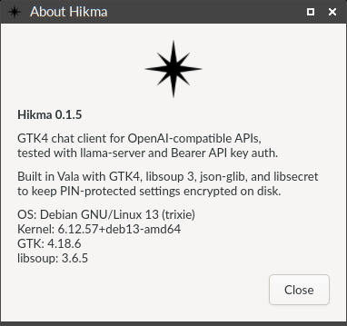
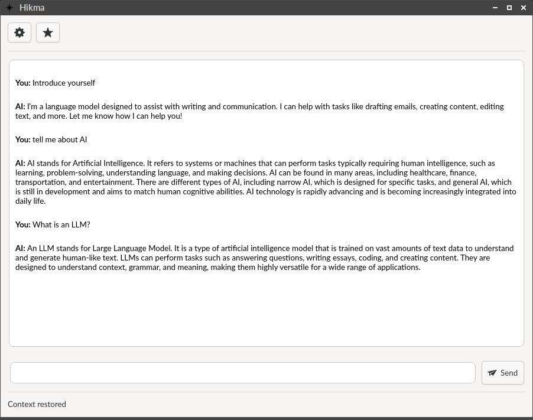
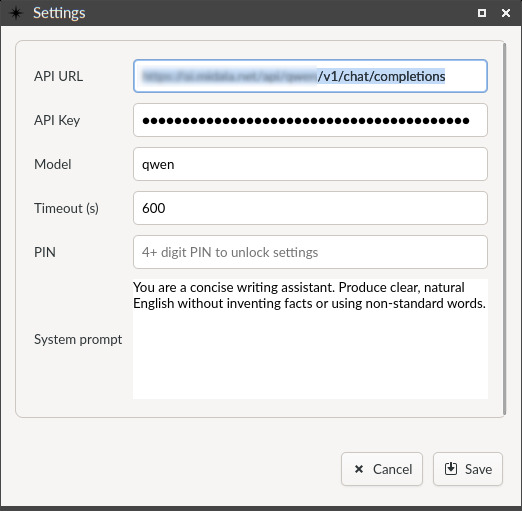

# Hikma (Vala + GTK4)

Hikma is a lightweight GTK4 chat client for OpenAI-compatible APIs. It focuses on privacy, simplicity, and predictable rendering. Written in Vala, it uses modern GNOME libraries (GTK4, WebKitGTK) and integrates with the system keyring for secure settings storage.

## Screenshots





## Features

- Plain-text chat rendering with auto-scroll
- Configurable API endpoint, model, and bearer token
- System prompt stored cleanly and prefixed at request time to enforce plain text + single paragraph
- Encrypted settings stored in the system keyring (`libsecret`)
- Simple packaging via Debian tooling; single main `.deb` copied to repo root

## Architecture Overview

- UI: GTK4 + `WebKit.WebView` for a simple DOM that appends escaped text
- Networking: `libsoup 3` + `json-glib` for HTTP and JSON
- Persistence: `libsecret` for secure storage of encrypted configuration and small chat context
- Build: Meson + Ninja (wrapped by a simple `Makefile`)

## Dependencies (Debian 13 / Trixie)

- `valac`, `libgtk-4-dev`, `libsoup-3.0-dev`, `libjson-glib-dev`, `libsecret-1-dev`
- `meson`, `ninja-build`, `git`
- `ca-certificates` (usually already installed)

## Build & Run

Using Meson directly:

```bash
meson setup build
meson compile -C build
./build/src/hikma
```

Using the Makefile wrapper:

```bash
make          # sets up Meson and compiles
make run      # builds then runs ./build/src/hikma
make install  # builds then installs via Meson
make debian   # binary-only Debian packages; copies main .deb to repo root
```

### Versioning

- The project version is defined once in `Makefile` via `APP_VERSION`.
- `make` synchronizes `meson.build` automatically via the `sync_version` rule.

## Configuration

Configure everything within the application (Settings). Required fields:

- API URL
- API key (Bearer token)
- Timeout in seconds (default: 90)
- System prompt (free text)
- PIN (required to save and unlock settings)

On startup, if saved settings are present, you will be prompted for the PIN to unlock them. The Send button remains disabled until settings are unlocked and complete.

## Security & Storage

- Settings are stored in the system keyring via `libsecret` (default collection). No sensitive data is written in plaintext.
- The user PIN is hashed with SHA-256 and used as a symmetric key (not the PIN itself). The derived key is also stored in the keyring to validate unlock attempts; the plaintext PIN is never stored.
- Sensitive fields (endpoint, API key, model, timeout, prompt) are XOR-encrypted byte by byte with the derived key, then Base64-encoded and persisted in the keyring as a single blob.
- On startup, Hikma asks for the PIN if saved settings are present; with the correct PIN, the configuration is decrypted and loaded. Without the correct PIN or a keyring, settings remain locked and cannot be used.

## Chat Context Cache

- A small, recent chat context is stored (encrypted) in the keyring to provide continuity across sessions.
- No plaintext cache files are written to disk.
- The cached context is limited to a fixed number of turns to avoid uncontrolled growth.
- The cache is used to prefill the request payload so the conversation remains coherent.

## Troubleshooting

- Verify required libraries: `ldd ./build/src/hikma` should show GTK4/libsoup/libsecret.
- Networking issues (timeouts, non-2xx responses) are surfaced in the UI status and message stream.

## License

Hikma is free software, released under the GNU General Public License, version 3 or (at your option) any later version. See `LICENSE` for details.
